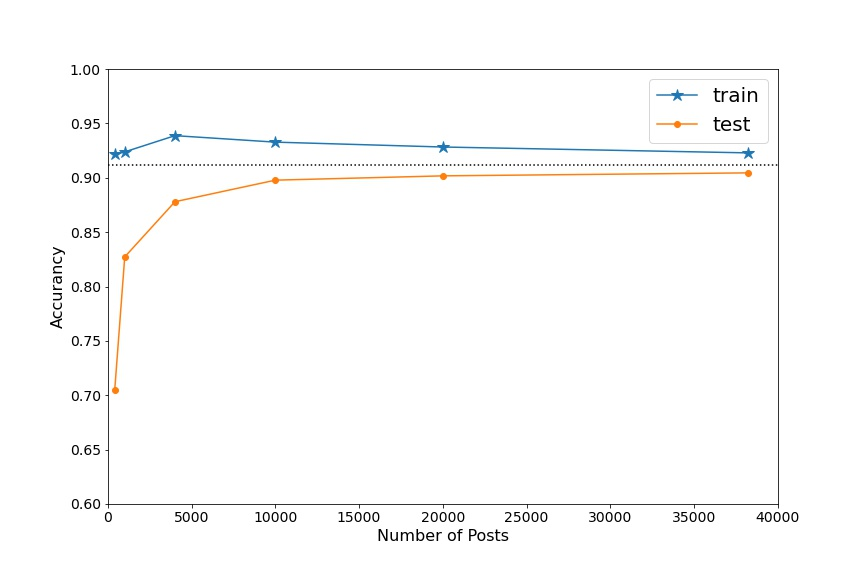
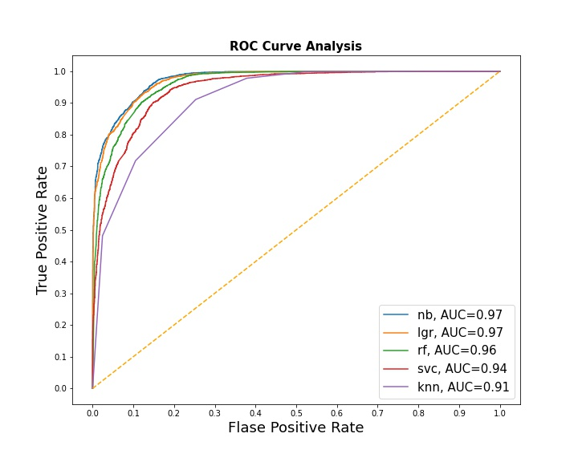
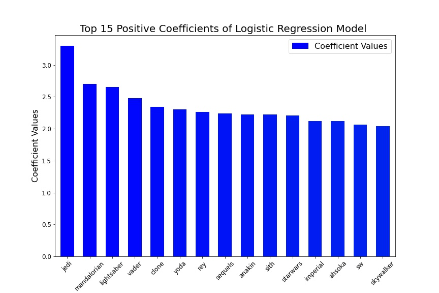
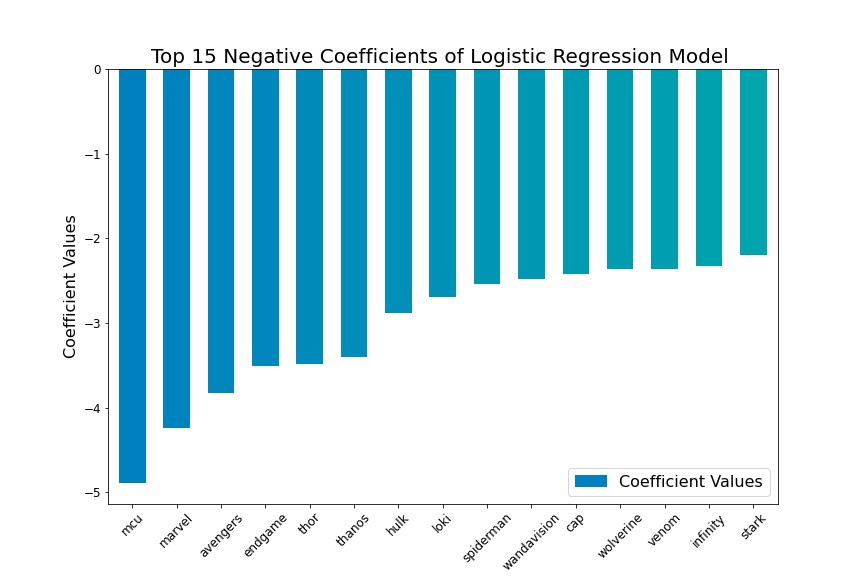

## Project 3 - StarWars or MarvelStudios - The Subreddit Classification
---  

---  
Star Wars and Marvel Studios are both famous symbols of the pop-culture and entertainment industry. They have been expanded into various films and other media, including television series, video games, novels, comic books, theme park attractions, and themed areas. There are millions of star wars fans and marvel fans all over the world. Can we find them? Can we tell whether one is a star war fan or marvel fan? We will apply AI and machine learning technique to figure this out.  

The data of this study was obtain from redit.com where the user submitted posts are organized by subject into "subreddits". The submissions from 'starwars' and 'marvelstudios' subreddits were collected by 'pushshift' API. Using these posts, a variety of classification machine learning models were built to predict which subreddit a post came from.

### Data preparation

- Subreddit  
  - [StarWars](https://www.reddit.com/r/StarWars/)  
  - [MarvelStudios](https://www.reddit.com/r/marvelstudios/)   
- 20,000 posts were collected from each of the two subreddits
- The title of the posts were used for this study and duplicated titles were discarded
- Final posts kept: 'starwars' - 19,044; 'marvelstudios' - 19184
- The relationship between model predicting accuracy and number of posts was investigated using Multinomial Naive Bayes Model. As can be seen from the chart below, 20,000 posts were enough to build decent model.

### Text Vectorizers comparison
- Count and Term Frequency-Inverse Document Frequency Vectorizers were compared with building Multinomial Naive Bayes models
- The models gave similar prediction results with these two Vectorizers

### Classification models comparison
||MNB|KNN|Logistic-Regression|Random Forest|SVM|   
  |---|---|---|---|---|---|
  |train|0.928|0.873|0.957|0.937|0.970|  
  |test|0.902|0.792|0.903|0.888|0.875|   

  - MNB and Logistic Regression models gave good scores for both training and testing datasets
  - Random forest and support vector machine models gave good scores for training datasets, but the scores for testing datasets are as good  
  - KNN model performed not as well as other models
  - Receiver operating characteristic (ROC) analysis on different models was consistent with the prediction scores  

### Logistic regression model optimization and evaluation

- Best parameters
  - Count Vectorizer: max_feature=8000, ngram = (1, 2), stop_words = ‘english’
  - Logistic Regression: C=1.2                        
- Prediction scores
  - Accuracy: 0.903
  - Sensitivity: 0.944
  - Specificity: 0.861  
- Top driving words (coefficients with large absolute values)   
  - Posts with these driving words had higher probability to be classified to 'starwars'(postiive coefficients) or 'marvelstudios'(negative coefficients).
  - Removing these top 15 driving words, the models performance downgraded:
    - Accuracy: 0.903 --> 0.853  
    - Sensitivity: 0.944 -->  0.878  
    - Specificity: 0.861 --> 0.829   

<tr>
    <td>  </td>
    <td>  </td>
    </tr>   

### Future work  

There are still rooms to reduce the overfitting of the classifiers.
- Bagging the classifiers
- Reducing the number of features
- Reducing the model complexity

### Directory structure

project-3   
|__ data   
|   |__ starwars_10000.csv  
|   |__ marvel_10000.csv  
|__ image  
|   |__ title_sub.jpg  
|   |__ numberofpost.jpeg   
|   |__ roc_curves_allmodels.jpeg  
|   |__ Top15_positive_coef.jpeg  
|   |__ Top15_negative_coef.jpeg  
|__ Project_3_reddit_starwars_and_marvelstudios_classification.pdf  
|__ 01_project3_get_data.ipynb  
|__ 02_project3_number_of_posts.ipynb   
|__ 03_project3_models.ipynb   
|__ README.md
